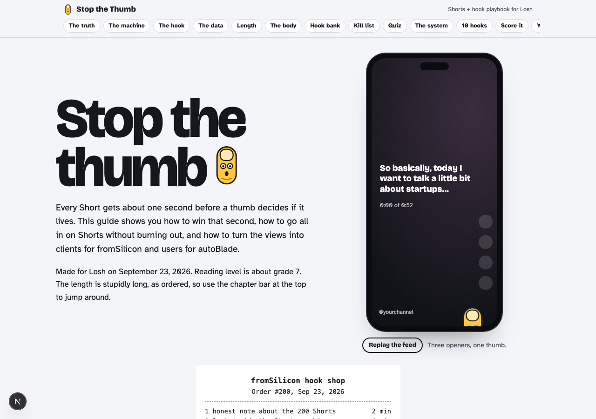
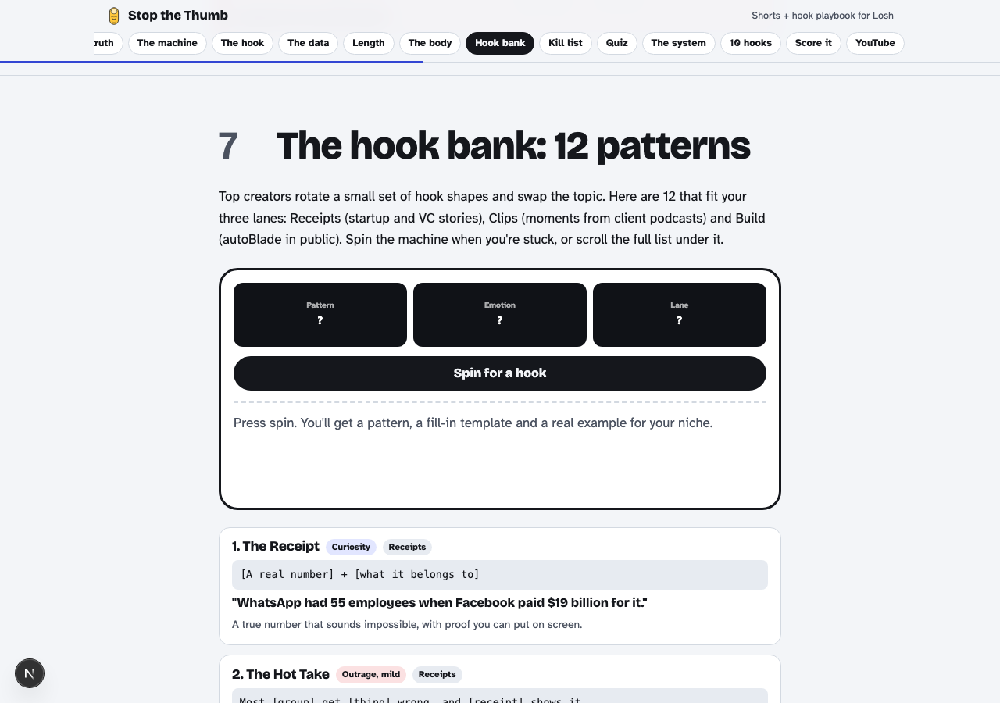
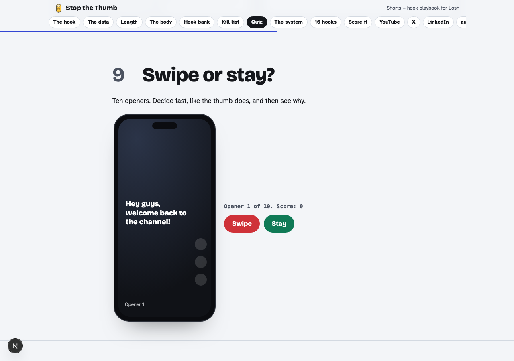
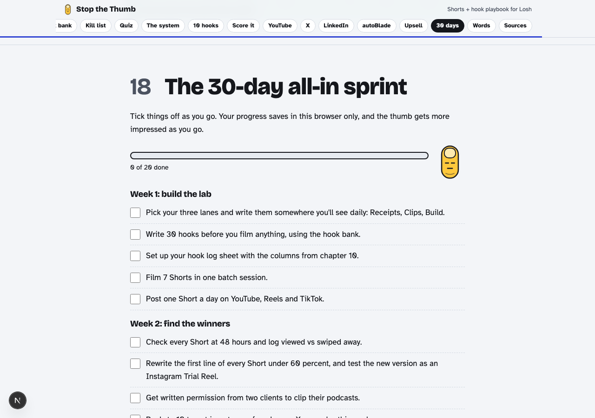

# stop the thumb

a long, visual playbook on how to hook viewers on shorts before they swipe away. built for losh at fromsilicon.

this is a next.js app version of the original claude artifact, live and interactive.

## screenshots









## what's inside

- the receipt hook: a 3-part formula for the first 3 seconds
- charts from real studies on shorts, reels and tiktok
- a hook bank with 12 patterns and a slot machine to spin for ideas
- a swipe or stay quiz
- a hook scorecard
- a 30 day checklist that saves your progress in the browser
- long-form, x and linkedin playbooks

## running it locally

```bash
npm install
npm run dev
```

then open http://localhost:3000

## stack

next.js (app router), plain css, vanilla js for the interactive bits. no extra frameworks.
